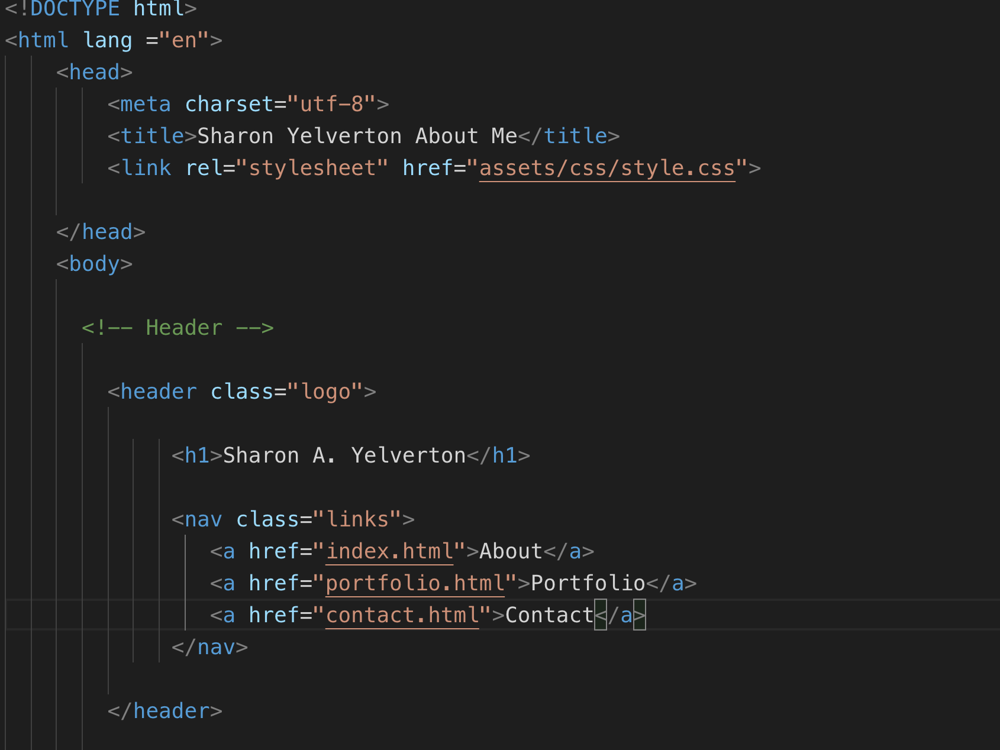
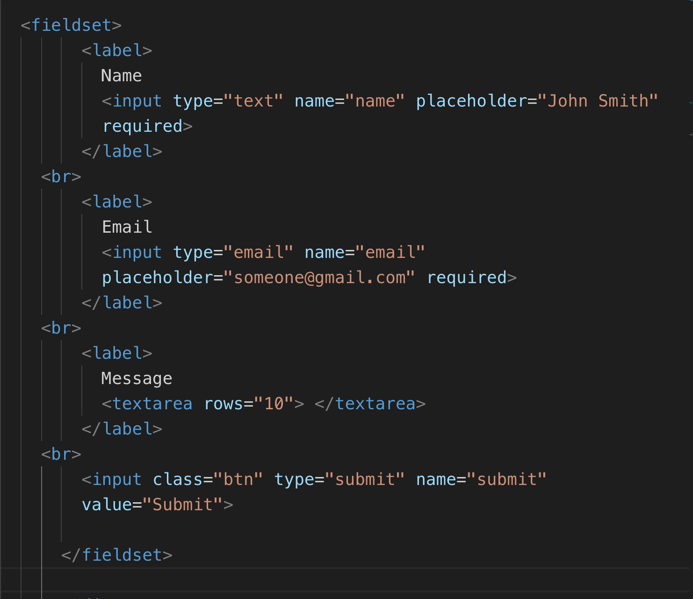
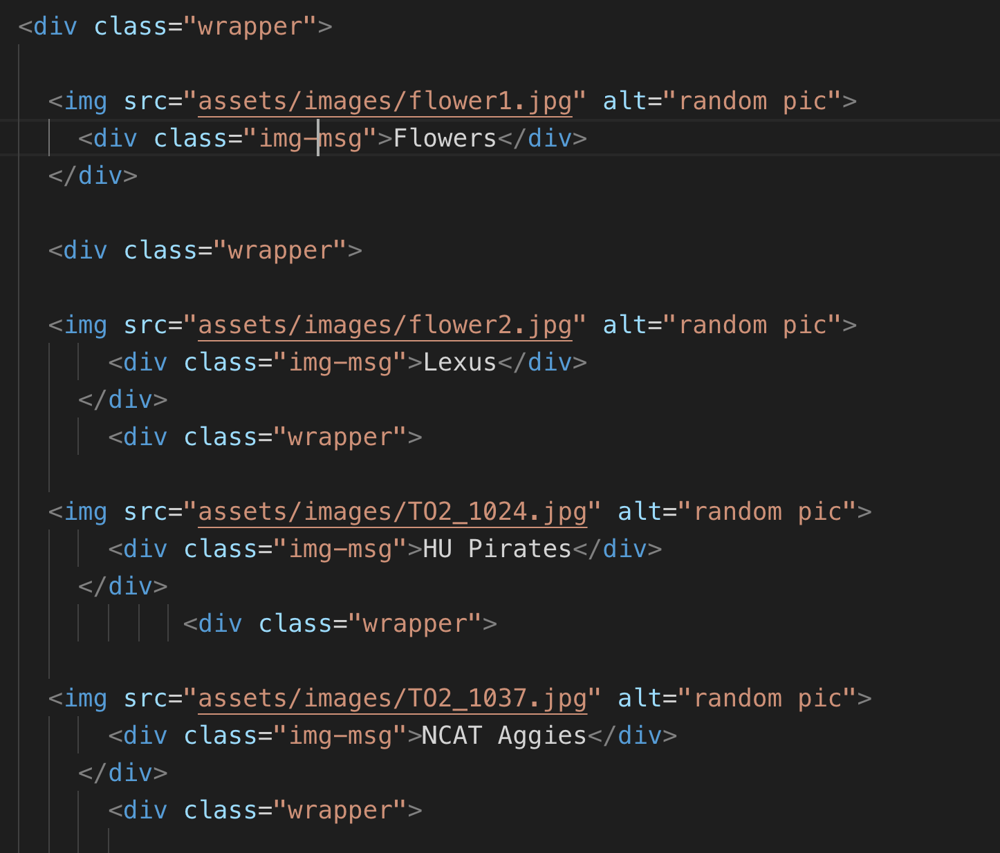
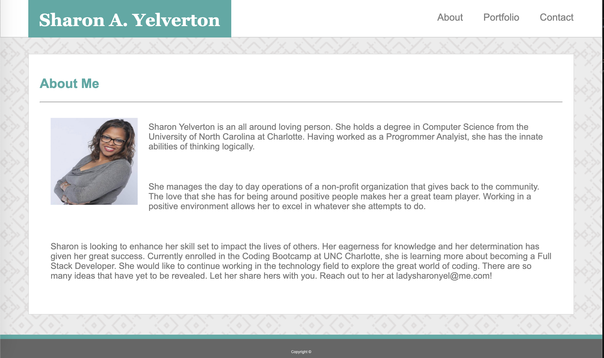
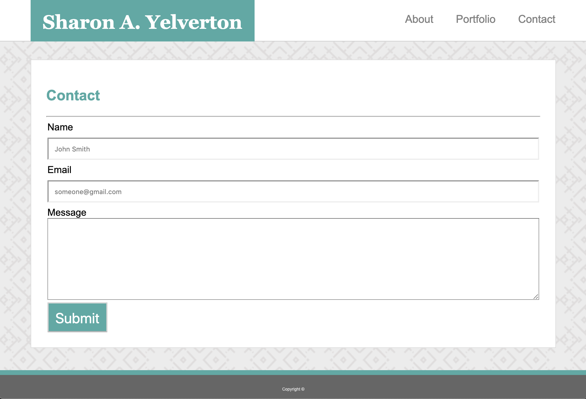
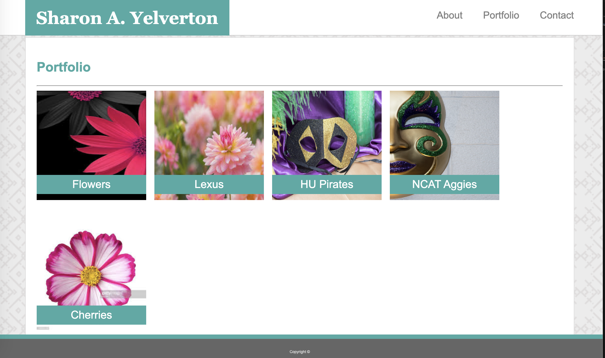

Sharon A. Yelverton's Portfolio
===
My personal webpage that showcases who I am and what I have accomplished.

Motivation
---

This project exist because it is my homework for coding bootcamp.  But seriously, this is a way to promote my skill set in order to land a better job

Code Style
---
 * HTML
 * CSS
  
List of Files
---
  * index.html
  * portfolio.html
  * contact.html

 
 
 Code Exmaples:
 ---
 
  

  

   
 
 
 
 Screen shots of the output
 ---
 
 
 
 
 
 Project source can be downloaded from (https://sharonyel.github.io/myportfolio/) 
 ---
 
 How to use the project
 ---
 
 
 1. Open the index.html file in your browser to get the About Me page.  
 2. From there you can navigate using the links on the top left side to go to the other pages.
 3. Read my Bio.
 4. Send me a message.
 5. Take a look at some of my work.

 (* *to be updated later* *)
 
Credits
---
 
 Will be listed later
 
 
 
 

